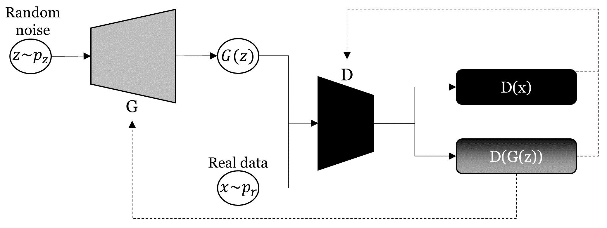
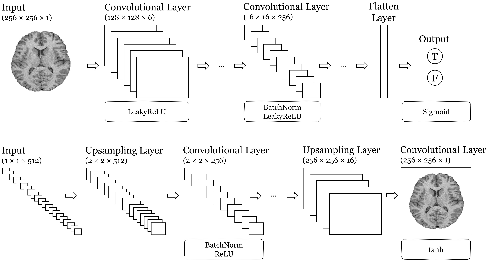
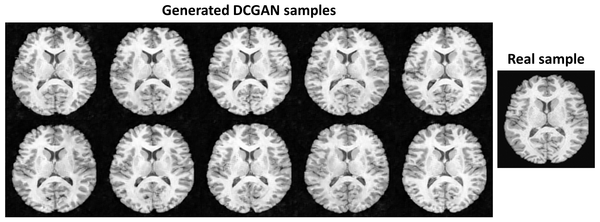

# dcgan

This repository serves to give an overview of Deep Convolutional GANs (DCGANs) and is based on my research performed during my master thesis at Linköping University.

To access the master thesis as pdf, click [here](http://urn.kb.se/resolve?urn=urn:nbn:se:liu:diva-166034).

## Abstract
Generative Adversarial Networks (GANs) have attracted much attention because of their ability to learn high-dimensional, realistic data distributions. In the field of medical imaging, they can be used to augment the often small image sets available. In this way, for example, the training of image classification or segmentation models can be improved to support clinical decision making. GANs can be distinguished according to their input. While Noise-to-Image GANs synthesize new images from a random noise vector, Image-To-Image GANs translate a given image into another domain. In this repository, I investigate the performance of a Noise-To-Image GAN (DCGAN), defined by its generated output quality and diversity. The data used consists of paired T1- and T2-weighted MR brain images, with the objective of generating additional T1-weighted images. Performance is evaluated by the use of an independent classifier that estimates the divergence between the generative output distribution and the real data distribution.

## Data

In total, 1113 T1- and T2-weighted MR brain images were provided by the [Human Connectome Project (HCP Young Adult release)](https://www.humanconnectome.org/study/hcp-young-adult). A subset of the data has been added to the repository.

## Architecture

<em>DCGAN architecture</em>. Generator G tries to map samples z from a defined random noise distribution pz to the real data distribution pr by G(z). Discriminator D takes samples x from pr and samples G(z) from the generator's output and tries to distinguish
them as correctly as possible. While D updates its parameters based on its classifications of real samples x and synthesized samples G(z), G updates its parameters based on how D classifies its synthesized samples G(z) only.

  

<em>DCGAN generator and discriminator</em>. Top: The discriminator. Given an input image of the shape 256 x 256 x 1, several convolutional layers are stacked. For each convolutional layer, the kernels are slid over the input feature maps with an increased stride. For example, by using zero-padding and a stride of two, the first convolutional layer halves the shape of each input channel (from 256 x 256 to 128 x 128). Batch normalization is not applied to the first convolutional layer. Leaky ReLU is applied to all convolutional layer outputs. After the convolution stack, the feature maps are flattened and passed to a sigmoid function. Bottom: The generator. A reshaped random vector of the shape 1 x 1 x 512 is mapped to the final output image of shape 256 x 256 x 1 by a stack of upsampling and convolutional layers. While the upsampling layers increase the shape of the input feature maps, the convolutional layers maintain the shapes of the input feature maps. This can be reached by using zero-padding and a stride of one. Batch normalization and ReLU are applied to the outputs of all convolutional layers except the last one, for which tanh is used. For both generator and discriminator, no fully connected or pooling layers are used.

## Results

