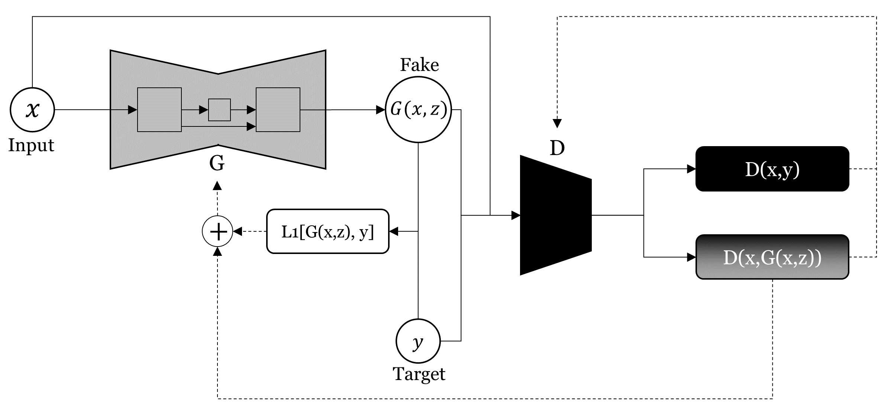
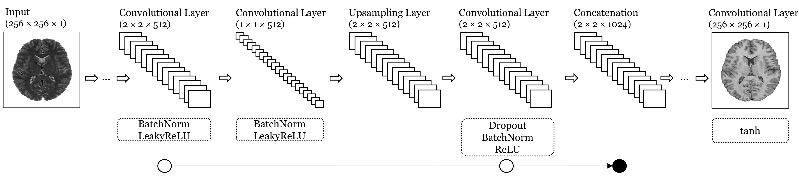
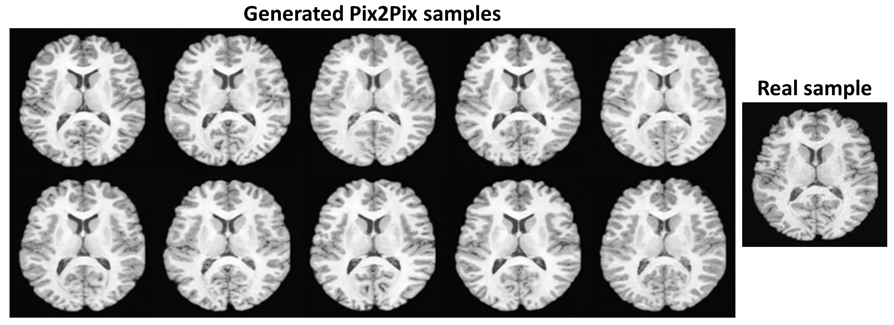

# GANs-Keras

This repository serves to give an overview of my thesis "Generating synthetic brain MR images using a hybrid combination of Noise-to-Image and Image-to-Image GANs" within the master program "Statistics and Machine Learning" at Linköping University.

To access the thesis as pdf, click [here](http://urn.kb.se/resolve?urn=urn:nbn:se:liu:diva-166034).

### Abstract
Generative Adversarial Networks (GANs) have attracted much attention because of their ability to learn high-dimensional, realistic data distributions. In the field of medical imaging, they can be used to augment the often small image sets available. In this way, for example, the training of image classification or segmentation models can be improved to support clinical decision making. GANs can be distinguished according to their input. While Noise-to-Image GANs synthesize new images from a random noise vector, Image-To-Image GANs translate a given image into another domain. In this study, it is investigated if the performance of a Noise-To-Image GAN, defined by its generated output quality and diversity, can be improved by using elements of a previously trained Image-To-Image GAN within its training. The data used consists of paired T1- and T2-weighted MR brain images. With the objective of generating additional T1-weighted images, a hybrid model (Hybrid GAN) is implemented that combines elements of a Deep Convolutional GAN (DCGAN) as a Noise-To-Image GAN and a Pix2Pix as an Image-To-Image GAN. Thereby, starting from the dependency of an input image, the model is gradually converted into a Noise-to-Image GAN. Performance is evaluated by the use of an independent classifier that estimates the divergence between the generative output distribution and the real data distribution. When comparing the Hybrid GAN performance with the DCGAN baseline, no improvement, neither in the quality nor in the diversity of the generated images, could be observed. Consequently, it could not be shown that the performance of a Noise-To-Image GAN is improved by using elements of a previously trained Image-To-Image GAN within its training.

## Data

In total, 1113 T1- and T2-weighted MR brain images were provided by the [Human Connectome Project (HCP Young Adult release)](https://www.humanconnectome.org/study/hcp-young-adult). A subset of the data has been added to the repository. 

:floppy_disk: [Access data subset](https://github.com/lennartsc/GANs-Keras/tree/master/data).

## DCGAN

### Architecture

<em>DCGAN architecture</em>. Generator G tries to map samples z from a defined random noise distribution pz to the real data distribution pr by G(z). Discriminator D takes samples x from pr and samples G(z) from the generator's output and tries to distinguish
them as correctly as possible. While D updates its parameters based on its classifications of real samples x and synthesized samples G(z), G updates its parameters based on how D classifies its synthesized samples G(z) only.

  

<em>DCGAN generator and discriminator</em>. Top: The discriminator. Given an input image of the shape 256 x 256 x 1, several convolutional layers are stacked. For each convolutional layer, the kernels are slid over the input feature maps with an increased stride. For example, by using zero-padding and a stride of two, the first convolutional layer halves the shape of each input channel (from 256 x 256 to 128 x 128). Batch normalization is not applied to the first convolutional layer. Leaky ReLU is applied to all convolutional layer outputs. After the convolution stack, the feature maps are flattened and passed to a sigmoid function. Bottom: The generator. A reshaped random vector of the shape 1 x 1 x 512 is mapped to the final output image of shape 256 x 256 x 1 by a stack of upsampling and convolutional layers. While the upsampling layers increase the shape of the input feature maps, the convolutional layers maintain the shapes of the input feature maps. This can be reached by using zero-padding and a stride of one. Batch normalization and ReLU are applied to the outputs of all convolutional layers except the last one, for which tanh is used. For both generator and discriminator, no fully connected or pooling layers are used.

### Code

:page_facing_up: [Access code](https://github.com/lennartsc/GANs-Keras/tree/master/dcgan).

### Results

## Pix2Pix

### Architecture

<em>Pix2Pix architecture</em>. The generator G and discriminator D are trained using pairs of input images x and target images y. Given an input image, the generator with its U-Net architecture, in which noise z is provided via dropout, generates a fake image G(x, z). The L1-distance between the generated fake and the target is computed. The discriminator in form of a PatchGAN concatenates the fake image with the input image and outputs a 30 x 30 image (D(x, G(x, z))). Based on the classification of each patch combined with the computed L1-distance, the generator is updated. Within the same iteration, the target image is also given to the discriminator. Again, after concatenating it with the input image, the patches of the target get classified (D(x, y)). Based on the classification of the fake and the target image patches, the discriminator is updated.

  

<em>Pix2Pix generator</em>. Starting from an input image, it is encoded using several convolutional layers in the same way as in the DCGAN discriminator. Again, batch normalization is not applied to the first convolutional layer. Leaky ReLU is applied to all convolutional layers up to the bottleneck layer that returns 1 x 1 feature maps. From this point on, the feature maps are decoded in the same way as in the DCGAN generator using the combination of upsampling and convolutional layers. Again, ReLU is used to activate the convolutional outputs. However, as in the DCGAN generator, the last convolutional layer uses tanh instead. Dropout is applied to the first three convolutional layers of the decoding part. A skip connection within this network is illustrated by concatenating the two 2 x 2 x 512 outputs of
the convolutional layers to one 2 x 2 x 1024 output. The network could also be represented in the shape of a U, where the layers to be concatenated are positioned on the same level.

### Code

:page_facing_up: [Access code](https://github.com/lennartsc/GANs-Keras/tree/master/pix2pix).

### Results

